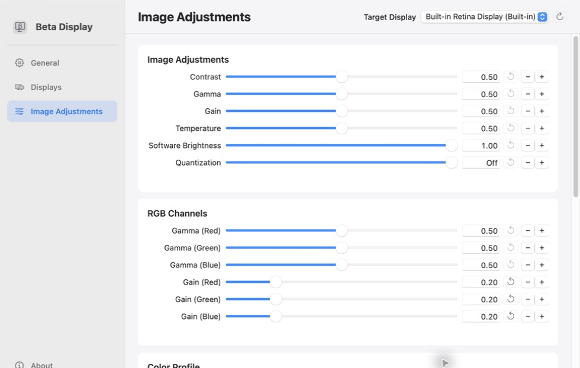
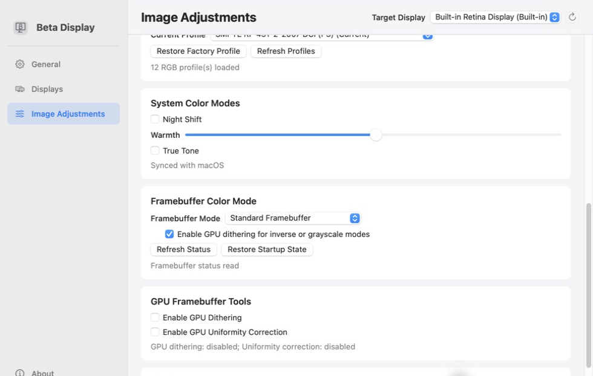
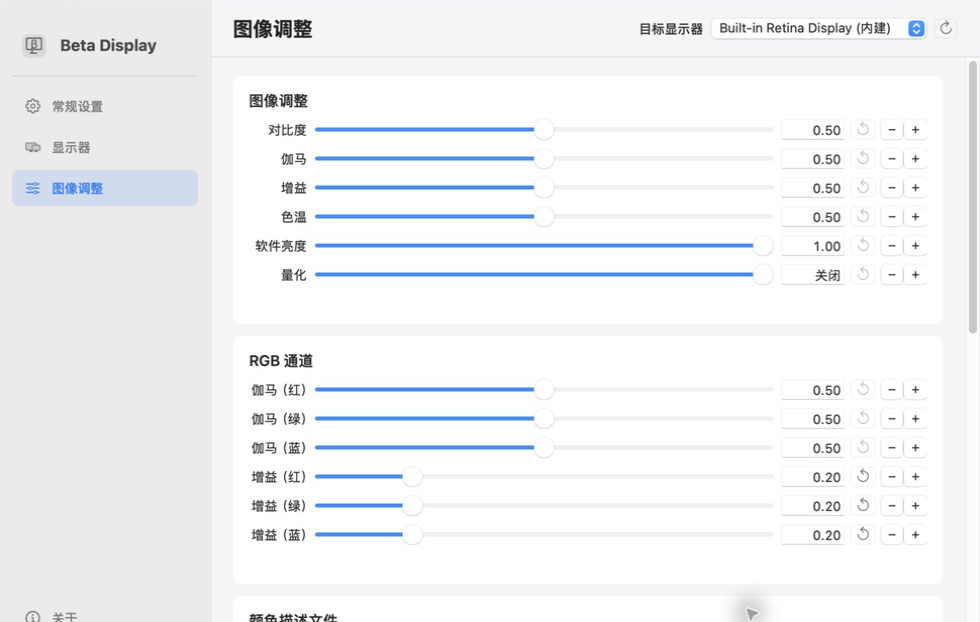
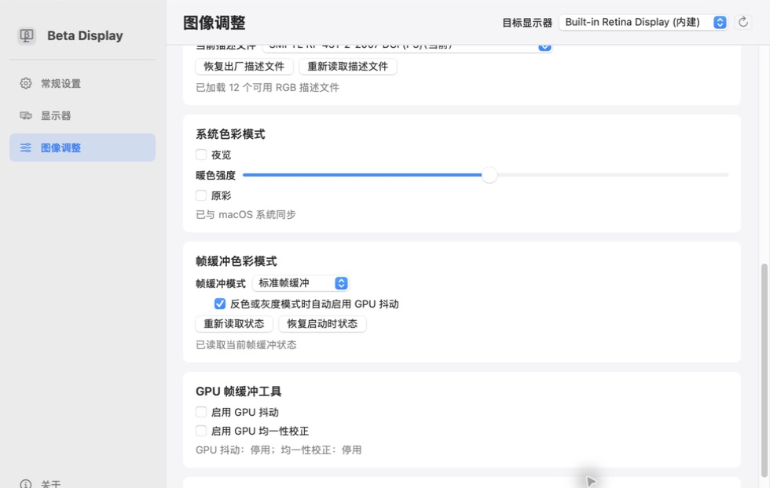

# Beta Display

Beta Display is a lightweight, native macOS utility that puts brightness, color, resolution, layout, and display-mode controls in one focused window. It supports both Apple silicon and Intel Macs.

## Screenshots

RGB gamma and gain controls:



System color modes, framebuffer modes, and GPU dithering controls:



## Requirements

- macOS 13 Ventura or later
- Apple silicon or Intel processor

## Install

Open the [latest release](https://github.com/ysdj/beta-display/releases/latest) and download the archive for your Mac:

- Apple silicon: `arm64`
- Intel: `x86_64`

Unzip the archive and move `Beta Display.app` to Applications. The app currently uses ad-hoc signing. If macOS cannot verify the developer on first launch, allow it from System Settings > Privacy & Security.

Homebrew installation:

```sh
brew tap ysdj/beta-display https://github.com/ysdj/beta-display
brew install --cask beta-display
```

## Features

- Hardware and software brightness, contrast, gamma, gain, temperature, and per-channel RGB controls
- Resolution, HiDPI scaling, refresh rate, display positioning, and mirroring
- ColorSync profiles, Night Shift, and True Tone
- Standard, inverted, grayscale, and inverted-grayscale framebuffer modes
- GPU dithering and uniformity controls when exposed by the selected display
- Display groups with synchronized image adjustments
- English and Simplified Chinese, a menu-bar control, and launch at login
- Copyable display diagnostics

Controls appear only when macOS and the selected display expose the required capability. Resolution, layout, mirroring, and image changes affect the display immediately.
Resolution changes are applied on demand and are never saved or restored automatically.

## Updates

Open About and choose Check for Updates. When a newer version is available, the same button changes to Open Release and opens the matching GitHub Release page.

Beta Display does not make automatic background network requests. It contacts GitHub's public Release API only when you manually check for updates.

## Uninstall

```sh
brew uninstall --zap --cask beta-display
brew untap ysdj/beta-display
```

For a manual installation, quit Beta Display and remove it from Applications.

## Build from source

<details>
<summary>Developer instructions</summary>

Xcode Command Line Tools and Swift 6 are required:

```sh
zsh scripts/build-app.zsh
open "dist/Beta Display.app"
```

### Runtime deployment gate

Do not treat a successful source build as proof that the running app is fixed.
When a change affects display recovery, install it only through:

```sh
zsh scripts/deploy-verified-app.zsh
```

The gate requests a normal shutdown of the existing app, verifies the source,
staged, and installed bundles (signature, self-test, version/build, checksum,
and recovery marker), then starts and verifies the exact app under
`/Applications/Beta Display.app`. It fails closed if any step is inconsistent.

</details>

---

# Beta Display（简体中文）

Beta Display 是一款轻量、原生的 macOS 显示器控制工具，把亮度、色彩、分辨率、布局和显示模式集中在一个清晰的窗口中，支持 Apple 芯片和 Intel Mac。

## 项目截图

RGB 伽马与增益控制：



系统色彩模式、帧缓冲模式与 GPU 抖动控制：



## 系统要求

- macOS 13 Ventura 或更高版本
- Apple 芯片或 Intel 处理器

## 安装

前往 [最新发布页面](https://github.com/ysdj/beta-display/releases/latest)，根据 Mac 处理器下载对应压缩包：

- Apple 芯片：`arm64`
- Intel：`x86_64`

解压后将 `Beta Display.app` 移入“应用程序”文件夹。应用目前采用 ad-hoc 签名；如果首次打开时 macOS 提示无法验证开发者，请在“系统设置 > 隐私与安全”中选择“仍要打开”。

Homebrew 安装：

```sh
brew tap ysdj/beta-display https://github.com/ysdj/beta-display
brew install --cask beta-display
```

## 主要功能

- 调整硬件亮度、软件亮度、对比度、伽马、增益、色温和 RGB 通道
- 切换分辨率、HiDPI 缩放和刷新率，配置显示器位置与镜像
- 选择 ColorSync 描述文件，控制 Night Shift 和 True Tone
- 使用标准、反色、灰度与反色灰度帧缓冲模式
- 在当前显示器公开能力时控制 GPU 抖动与均一性校正
- 保存显示器群组并同步图像调整
- 支持英文和简体中文界面、菜单栏入口及登录时启动
- 查看并复制显示器诊断信息

部分控制项只会在 macOS 和当前显示器公开相应能力时出现。更改分辨率、布局、镜像或图像参数会立即影响显示输出。
分辨率仅按当次操作更改，Beta Display 不会保存或自动还原分辨率。

## 检查更新

打开“关于”，点击“检查更新”。如果发现新版本，该按钮会变为“打开发布页面”，再次点击即可前往对应的 GitHub Release 下载。

Beta Display 不会在后台自动联网；只有手动检查更新时才会请求 GitHub 的公开 Release API。

## 卸载

```sh
brew uninstall --zap --cask beta-display
brew untap ysdj/beta-display
```

手动安装时，退出 Beta Display 后从“应用程序”文件夹删除应用即可。

## 从源码构建

<details>
<summary>开发者说明</summary>

需要 Xcode Command Line Tools 和 Swift 6：

```sh
zsh scripts/build-app.zsh
open "dist/Beta Display.app"
```

### 运行中应用部署门禁

源码构建成功不代表正在运行的应用已经修复。凡是涉及显示器恢复逻辑的改动，只能通过以下命令安装：

```sh
zsh scripts/deploy-verified-app.zsh
```

该门禁会先请求旧应用正常退出，再验证源包、暂存包和安装包的签名、自检、版本/构建号、校验和与恢复标记；最后启动并核验准确的 `/Applications/Beta Display.app`。任何一步不一致都会失败，不会把未验证版本当作已部署。

</details>
